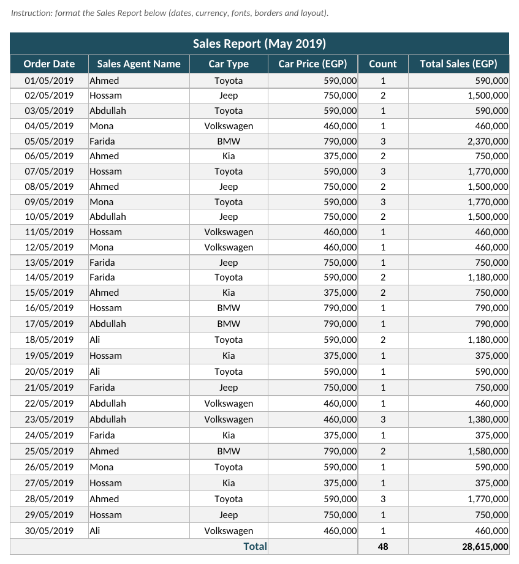
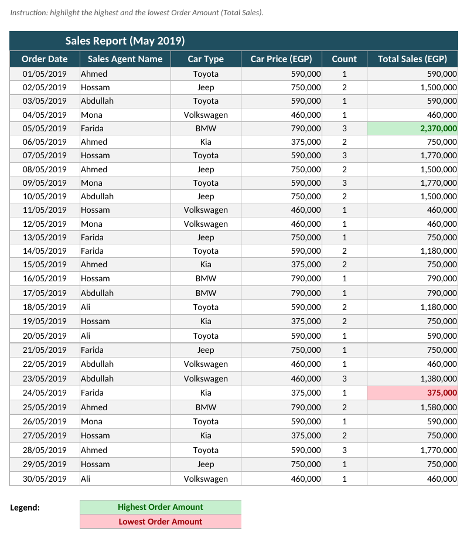
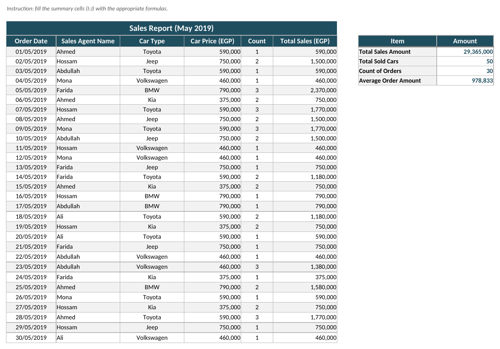
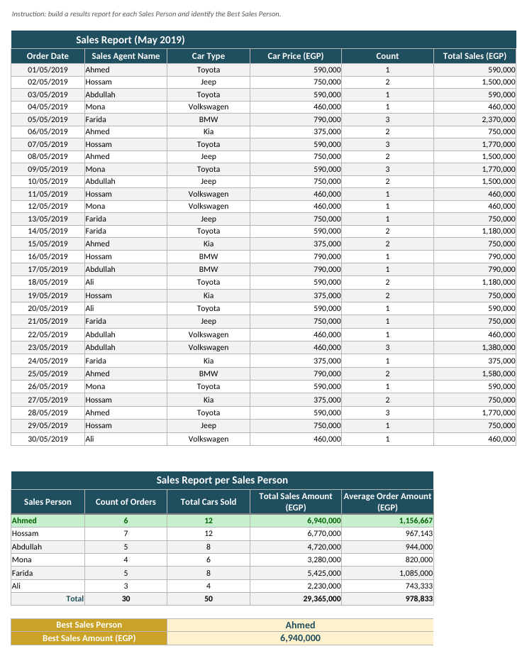
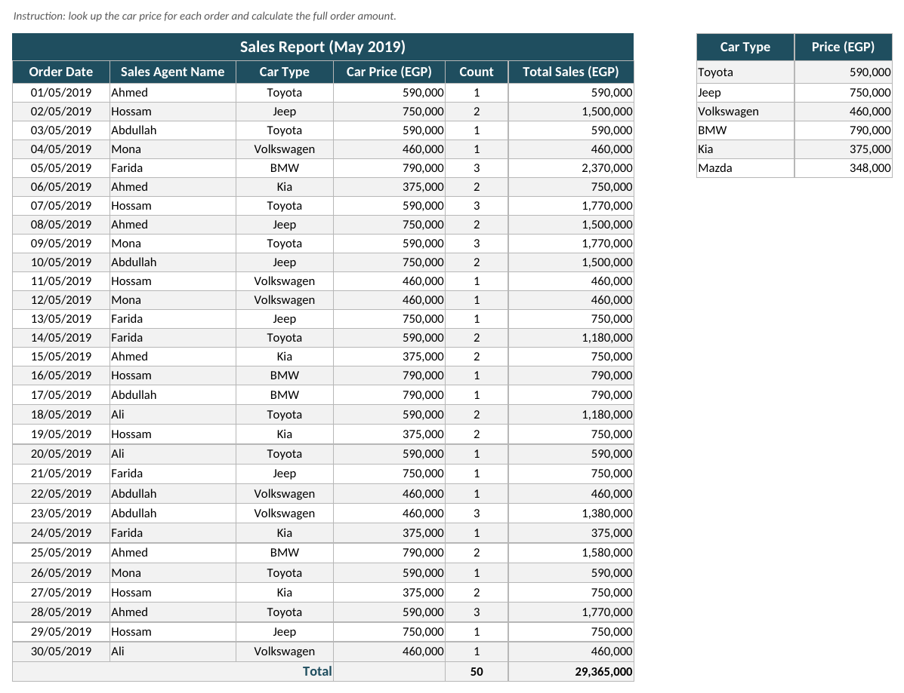
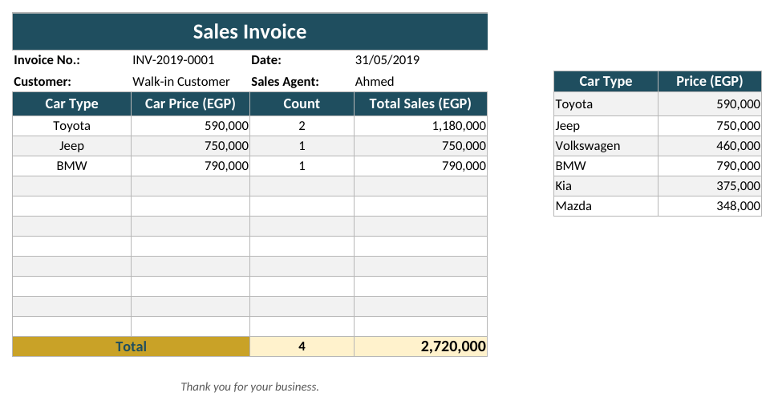

# Excel Sales Report: Seven Practical Tasks

**KOUAME Koffi Fidèle** · Data Analysis Practice

A single workbook, `KOUAME_Koffi_Fidele_Excel_Tasks.xlsx`, covering seven practical Excel
exercises on a car-dealership sales report: professional formatting, conditional
formatting, lookups, summary formulas, a per-salesperson report, and a printable invoice.
Every result is a **live formula**, not a typed-in number, change a price or a count and
the whole workbook recalculates.

A companion report, `KOUAME_Koffi_Fidele_Excel_Sales_Report.pdf`, documents each task with
the formulas used and a screenshot of the result.

## Contents

| Sheet | Task | What it demonstrates |
| :--- | :--- | :--- |
| `Contents` | Cover | Self-documenting front sheet: contents, method, validation, with links to every task |
| `Task 1` | Formatting | Dates, currency, fonts, borders, a clean table layout |
| `Task 2` | Conditional formatting | Highlighting the highest and lowest Order Amount |
| `Task 3` | Conditional formatting + MAX/MIN | Green/red vs. a Target cell, `MAX`/`MIN` |
| `Task 4` | Formulas | `SUM`, `COUNTA`, `AVERAGE` for a KPI summary |
| `Task 5` | Sales analysis | `SUMIF`/`COUNTIF`/`AVERAGEIF` per salesperson, `INDEX`/`MATCH` for the best performer |
| `Task 6` | Lookup | `VLOOKUP` against a price table, full order amount |
| `Task 7` | Invoice | A formatted bill built from the same lookup table |

## Preview

### Task 1: Formatting

### Task 2: Highest / lowest Order Amount

### Task 3: Target-based conditional formatting

### Task 4: Summary formulas

### Task 5: Per-salesperson report

### Task 6: Price lookup

### Task 7: Invoice

## Method

- **Formulas, never hard-coded results.** Every total, average, lookup and ranking is a
  formula (`SUM`, `AVERAGE`, `COUNTA`, `SUMIF`, `COUNTIF`, `AVERAGEIF`, `VLOOKUP`,
  `INDEX`/`MATCH`, `MAX`, `MIN`), so the workbook stays correct if the underlying data
  changes.
- **Conditional formatting, not manual colouring.** The highest/lowest highlights (Task 2),
  the target comparison (Task 3) and the best-salesperson highlight (Task 5) are rule-based,
  so they update automatically.
- **One consistent style across all seven sheets:** a dark-navy header bar, currency stated
  once per column header (EGP), `dd/mm/yyyy` dates, thin borders, subtle row banding, and
  Calibri throughout.
- **Named ranges.** `PriceTable`, `InvoicePriceTable`, `SalesTarget` and `OrderTable`. A
  formula that reads `PriceTable` states its intent; `$J$4:$K$9` states only its address.
- **Validated entry.** Car Type is a drop-down list on every sheet that uses it. A typed
  value such as *Toyata* would break the `VLOOKUP` silently and return `#N/A`; the list
  prevents the mistake at the point of entry rather than catching it afterwards.
- **Filterable tables.** `AutoFilter` is enabled on every order table, so a reviewer can
  sort and filter without altering anything.
- **Print-ready.** Every sheet is set to fit on a single landscape page, with the header
  row frozen.

## Data

The source data is a synthetic 30-order car-sales log for May 2019 (order date, sales
agent, car type, price, count), with a six-model price list (Toyota, Jeep, Volkswagen,
BMW, Kia, Mazda) used for the lookups in Tasks 6 and 7. It is for practice purposes only.

## Tools

Microsoft Excel / LibreOffice Calc. Built and validated with `openpyxl` and a LibreOffice
headless recalculation pass: **244 formulas, zero errors**.
